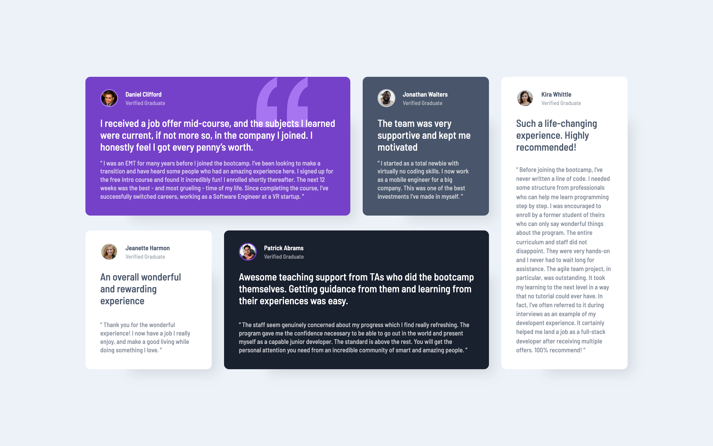

# Frontend Mentor - Testimonials grid section solution

This is a solution to the [Testimonials grid section challenge on Frontend Mentor](https://www.frontendmentor.io/challenges/testimonials-grid-section-Nnw6J7Un7). Frontend Mentor challenges help you improve your coding skills by building realistic projects.

## Table of contents

- [Frontend Mentor - Testimonials grid section solution](#frontend-mentor---testimonials-grid-section-solution)
  - [Table of contents](#table-of-contents)
  - [Overview](#overview)
    - [The challenge](#the-challenge)
    - [Screenshot](#screenshot)
    - [Links](#links)
  - [My process](#my-process)
    - [Built with](#built-with)
    - [What I learned](#what-i-learned)
    - [Useful resources](#useful-resources)
  - [Author](#author)
  - [Acknowledgments](#acknowledgments)

## Overview

### The challenge

- The grid component
- Responsive website
- Background color with image

### Screenshot

<strong>Mobile View</strong>

<strong>Descktop View</strong>

### Links

- Solution URL: [Testimonials Grid Section with Sass and Grid Layout](https://www.frontendmentor.io/solutions/testimonials-grid-section-with-sass-and-grid-layout-t8Tp_t8ZY7)
- Live Site URL: [Frontend Mentor | Testimonials Grid Section](https://vangmanawkairung.github.io/Frontend-Mentor_testimonials-grid-section/)

## My process

### Built with

- Semantic HTML5 markup
- CSS custom properties
- Flexbox
- CSS Grid
- Sass/Scss

### What I learned

- How to use the background-color along with background-image.
- How to handle with grid and its properties.

### Useful resources

- [grid - CSS](https://developer.mozilla.org/en-US/docs/Web/CSS/grid) - This website helps me to handle with the grid display layout
- [A Complete Guide to CSS Grid](https://css-tricks.com/snippets/css/complete-guide-grid/) - This website clearifies the grid layout attributes.
- [gap](https://developer.mozilla.org/en-US/docs/Web/CSS/gap) - This website demonstrates how to handle with grid gap.
- [grid-column](https://developer.mozilla.org/en-US/docs/Web/CSS/grid-column) - This website shows how to manage the gird layout.
- [CSS background-position Property](https://www.w3schools.com/cssref/pr_background-position.php) - The resource describes how to use backpgroud-position property.

## Author

- Frontend Mentor - [@VangmanawKairung](https://www.frontendmentor.io/profile/VangmanawKairung)
- GitHub - [VangmanawKairung](https://github.com/VangmanawKairung)

## Acknowledgments

I appreciate to Frontend Mentor Team for spending the time to make this challenge.
